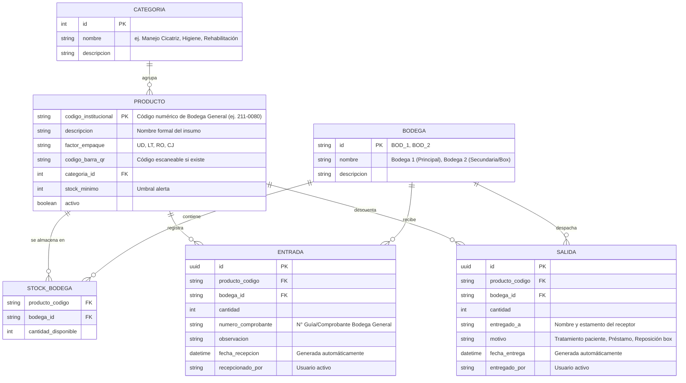

# Especificación de Requisitos de Software (SRS)
## Sistema de Control y Gestión de Inventario — Servicio de Medicina Física y Rehabilitación

---

### 1. Propósito y Contexto del Proyecto

#### 1.1 Objetivo General
Desarrollar una aplicación web progresiva (PWA / Mobile First) para el **Servicio de Medicina Física y Rehabilitación**, orientada al control integral, trazabilidad y gestión en tiempo real del stock de insumos y materiales clínicos que son despachados mensualmente por la **Bodega General del Hospital**.

#### 1.2 Problema que Resuelve
Actualmente, el flujo depende de listados estáticos en Excel provistos por Bodega General con códigos numéricos institucionales. Esto genera dificultades para:
- Saber la disponibilidad exacta en el servicio en tiempo real.
- Conocer en cuál de los recintos físicos del servicio (**Bodega 1** o **Bodega 2**) está almacenado cada insumo.
- Mantener registro de **a quién se le entregó** cada insumo y en qué fecha.
- Realizar conteos rápidos mediante dispositivos móviles en los puntos de almacenamiento.

#### 1.3 Entorno de Ejecución y Destino
El presente documento define la especificación técnica y de requerimientos para ser interpretada, iterada y construida directamente en **Antigravity IDE**.

---

### 2. Alcance y Flujos Operativos

#### 2.1 Flujo de Entrada (Recepción de Pedido Mensual de Bodega General)
1. **Llegada del Despacho:** Llega el pedido periódico desde Bodega General.
2. **Identificación del Insumo:**
   - Escaneo mediante la cámara del celular (código de barras o QR si viene impreso).
   - O búsqueda/ingreso rápido del **código numérico institucional** (ej. `211-0080`, `225-0145`) provisto en la planilla de Bodega General.
3. **Detalle del Ingreso:**
   - El operador ingresa la cantidad recibida.
   - Selecciona el destino físico dentro del servicio: **Bodega 1** o **Bodega 2**.
   - Se registra de manera automática la **fecha y hora de recepción**.
4. **Actualización:** El sistema suma de inmediato las cantidades al stock total y al desglose por bodega.

#### 2.2 Flujo de Salida (Entrega y Despacho Interno)
1. **Solicitud de Insumo:** Un profesional o técnico acude a retirar un material (ej. caja de cinta tape, vendas, apósitos, toallas).
2. **Registro de Salida:**
   - Se escanea el código del producto o se busca por nombre/código numérico.
   - Se indica la cantidad extraída.
   - Se selecciona desde cuál recinto se retira (**Bodega 1** o **Bodega 2**).
   - **Registro Obligatorio del Receptor:** Campo *"A quién se le entrega"* (nombre del profesional, estamento, box o servicio solicitante).
   - Se guarda de forma automática la **fecha y hora de entrega**.
3. **Actualización:** Se descuenta automáticamente del inventario disponible.

#### 2.3 Visualización, Filtros y Categorización
- **Filtrado por Ubicación Física:** Vistas independientes para consultar existencias exclusivas de **Bodega 1**, **Bodega 2** o el inventario global consolidado.
- **Categorización Temática de Insumos:**
  - **Manejo de Cicatriz y Compresivos:** Cintas tape (K-Tape, Durapore), mallas tubulares, vendas de compresión elástica (BSN Comprilan), láminas de silicona/apósitos.
  - **Insumos de Rehabilitación y Terapia:** Agujas de acupuntura/punción seca, parches, témperas/material de estimulación sensorio-motriz, elementos de terapia ocupacional.
  - **Soporte Respiratorio / Fonación:** Sondas de oxígeno, bigoteras adulto/pediátrico, válvulas de fonación con puerto de O2.
  - **Higiene, Aseo y Protección Clínica:** Alcohol, glicerina neutra, torulas, gorros desechables, bolsas de residuos.
  - **Material Administrativo / Papelería:** Formularios, útiles de registro.

---

### 3. Modelo de Datos y Entidades

---

### 4. Requisitos Funcionales Detallados

| ID | Módulo | Requisito Funcional |
| :--- | :--- | :--- |
| **RF-01** | **Catálogo Base** | El sistema debe precargar el catálogo con los códigos numéricos y descripciones entregadas por Bodega General en el archivo Excel. |
| **RF-02** | **Escaneo Multimodal** | La interfaz móvil debe permitir activar la cámara del celular para escanear códigos de barra o códigos QR, y ofrecer como alternativa la búsqueda por coincidencia numérica inmediata. |
| **RF-03** | **Recepción con Destino** | Al ingresar una entrada, el usuario debe especificar obligatoriamente la cantidad y si ingresa a **Bodega 1** o **Bodega 2**. |
| **RF-04** | **Timestamp Automático** | Las entradas y salidas deben estampar fecha y hora del sistema de forma automática sin requerir digitación manual del operador. |
| **RF-05** | **Trazabilidad de Destinatario** | Toda salida de inventario debe exigir el campo obligatorio *"Entregado a"* para saber exactamente qué profesional o unidad recibió el producto. |
| **RF-06** | **Descuento de Stock por Bodega** | La salida debe descontar las unidades de la bodega seleccionada y alertar si la cantidad requerida supera el stock disponible en dicha ubicación. |
| **RF-07** | **Filtrado Dinámico** | El panel de control debe contar con selectores rápidos para filtrar por: (a) Bodega 1, (b) Bodega 2, (c) Categoría clínica, (d) Estado de stock (Normal, Bajo, Agotado). |
| **RF-08** | **Historial y Auditoría** | Vista con bitácora cronológica que permita auditar todas las salidas: qué se sacó, cuándo, de qué bodega y a quién se le entregó. |

---

### 5. Requisitos No Funcionales

1. **Diseño Mobile-First (PWA):** Optimizado para uso ergonómico desde teléfonos inteligentes de los profesionales dentro de las bodegas o boxes de atención.
2. **Velocidad de Lectura:** El reconocimiento de código o búsqueda numérica debe arrojar el insumo en menos de 1 segundo.
3. **Funcionamiento Offline / Resiliente:** Capacidad de cachear el catálogo localmente en el dispositivo en caso de zonas con baja cobertura WiFi dentro del hospital.
4. **Simplicidad de Uso:** Formulario de salida ejecutable en menos de 3 toques/pasos en pantalla para no interrumpir la dinámica asistencial.

---

### 6. Roadmap de Implementación en Antigravity IDE

- **Fase 1: Migración e Ingesta de Datos**
  - Importar el archivo Excel inicial de Bodega General.
  - Normalizar categorías clínicas e inicializar las tablas de `Bodega 1` y `Bodega 2`.
- **Fase 2: Interfaz de Entrada y Salida Rápida (Mobile View)**
  - Implementar componente de cámara con lector de código de barras/QR (`html5-qrcode` o `@zxing/library`).
  - Formulario ágil de salida con autocompletado de destinatario y selector de bodega.
- **Fase 3: Dashboard de Existencias y Categorías**
  - Vistas agrupadas por familia de insumos (Cicatrices, Respiratorio, Aseo, etc.).
  - Semáforo de reposición para coordinar el pedido mensual hacia Bodega General.
